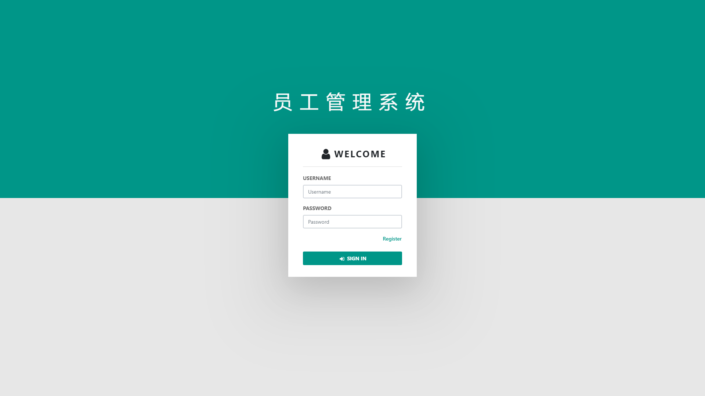
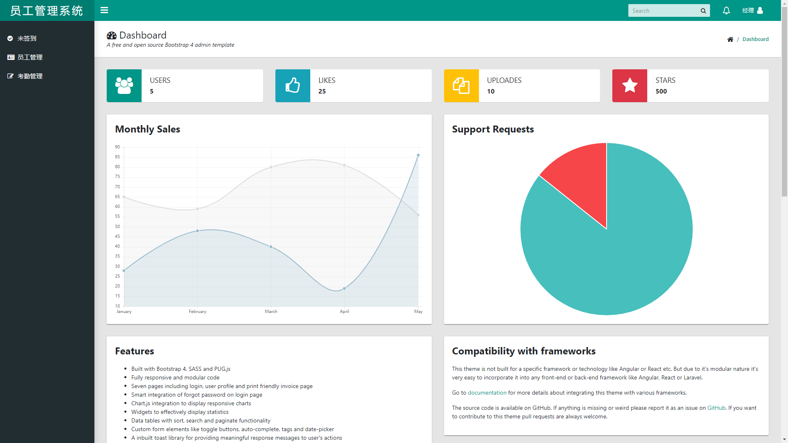
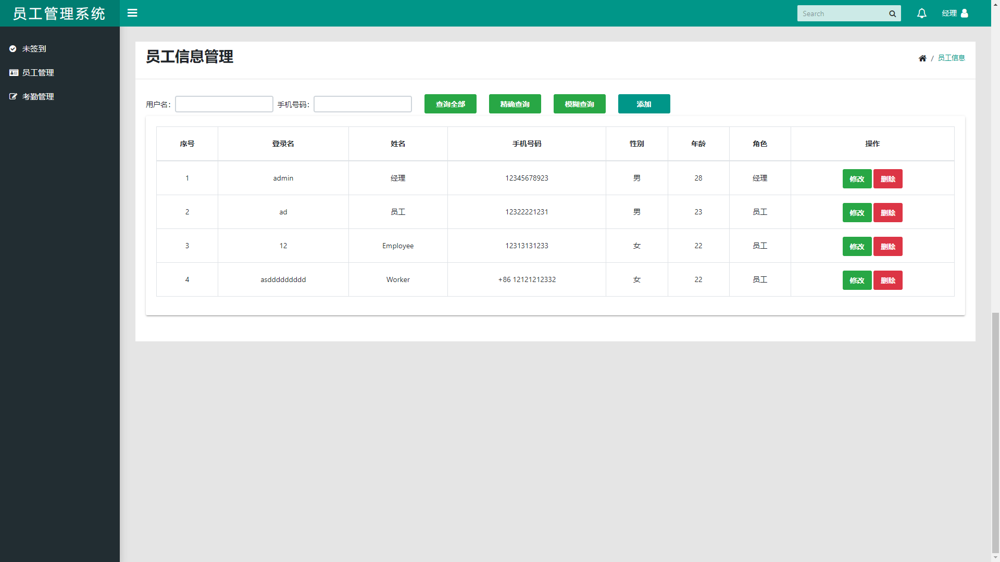

# MVC-Java-Web-Demo

MVC模式下的Java Web程序——员工管理系统

## 环境

- 操作系统：Windows 10家庭中文版
- 集成开发环境：Eclipse Jee Mars 2
- 数据存储：MySQL 5.5.20
- 服务支持：Tomcat 7.0.86

## 界面展示

登录界面

主界面

员工管理界面

## 已知的问题

- 必须运行 `WebContent/login.jsp`（即必须从登录页运行）
- 修改自己的签到状态后签到状态不会即使更新

## 其他资源

- [项目报告.pdf](document\员工管理系统项目报告.pdf)
- [项目报告.doc](document\员工管理系统项目报告.doc)
